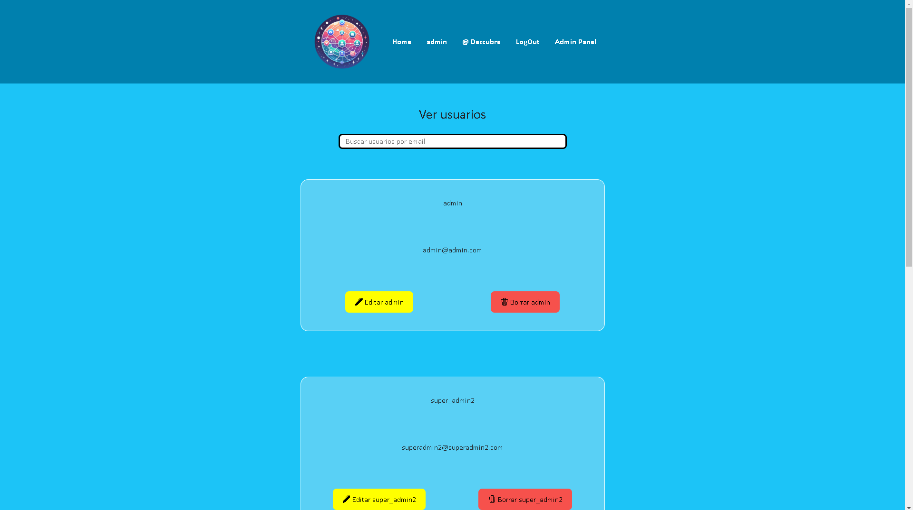

# SocialMedia 🌐


Hi Geeks! I have made a Front End website based on   of the Api Rest Backend that I made about a Social Netwowk

([Repository Link Here! ⬅](https://github.com/FRR95/Proyecto-API-Buscador-Backend-II))

## Index 🧾

<details>

<summary>Index 🧾</summary>

- [Technologies ⚙](#technologies-)
- [Pages 📇](#pages-)
- [Features](#features)
- [Deployment 👁‍🗨](#deployment-)
- [Download ⬇](#download-)
- [Roadmap ❗](#roadmap-)
- [Author 🙍‍♂️](#author-🙍‍♂️)
- [Time of development ⌛](#time-of-development-)

</details>


## Technologies ⚙


## Pages 📇

<details>
<summary>Pages 📇</summary>

### Home.jsx

***Desktop version***


***Mobile version***


***When you are logged (Timeline)***


### Discover.jsx


### Register.jsx


### Login.jsx


### Profile.jsx

***Desktop version***


***Mobile version***


### AdminPanel.jsx




### PostDetail.jsx


### ProfileDetail.jsx

***Desktop version***


***Mobile version***


</details>

## Features

**✅ Login,Register and LogOut User 🙍‍♂️**

**✅ Update user profile ✏**


**✅ Create ,read , update and delete your posts 📋**

**✅ Read users profiles and their posts in detail** 


**✅ Delete and update users profiles** *


**✅ Update and delete users posts** *

**⬜Comment a post** 

**⬜Post images or videos**


#### * These features are only available for those users who have the admin role 🚩


## Deployment 👁‍🗨


> [Front End](https://master.d2gshtpsyzwxp0.amplifyapp.com/) ⬅ 


> [Back End](https://proyecto-api-buscador-backend-ii-dev-zkex.2.ie-1.fl0.io/)⬅


## Download ⬇

#### Open your terminal and:

**1-Clone this repository**

```sh
git clone https://github.com/FRR95/Proyecto-API-Buscador-Frontend-II.git
```

**2-Install the dependencies**

```sh
npm i
```

**3-Run the localhost website**


```sh
npm run dev
```


## Roadmap ❗

**1-Watch the home page**

**2-Register your account**

**3-Login your account**
```sh
admin account:

email:admin@admin.com
password:12345678
```
**4-Watch your profile**

**5-Update your profile**

**6-Create a post**

**7-Delete/Update a post**

**8-Watch all the User profiles** 

**9-Watch a user profile in detail and his posts** 

**10-Watch a user profile in detail and his posts** 

**11-Update/Delete a user profile info and his posts** *


#### * These options are only available for those users who have the admin role 🚩

## Author 🙍‍♂️

- **Francisco Rocher Roure** - FullStack Developer
  - [GitHub](https://github.com/FRR95) - [LinkedIn](https://www.linkedin.com/in/franciscorocher/) - [Portfolio](https://franciscorocherdev.com/)


## Time of development ⌛

- One week